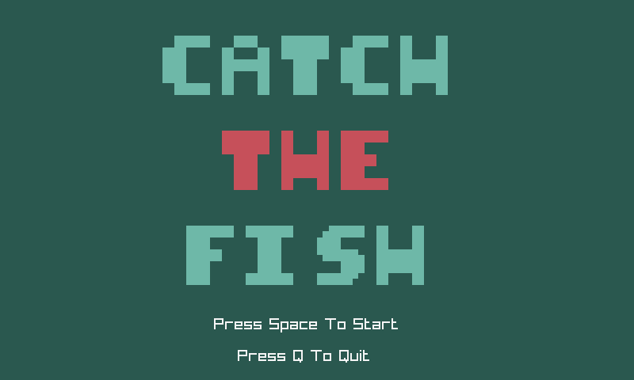
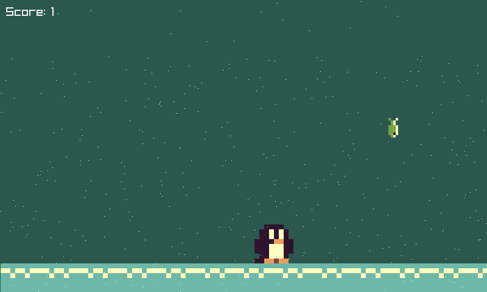
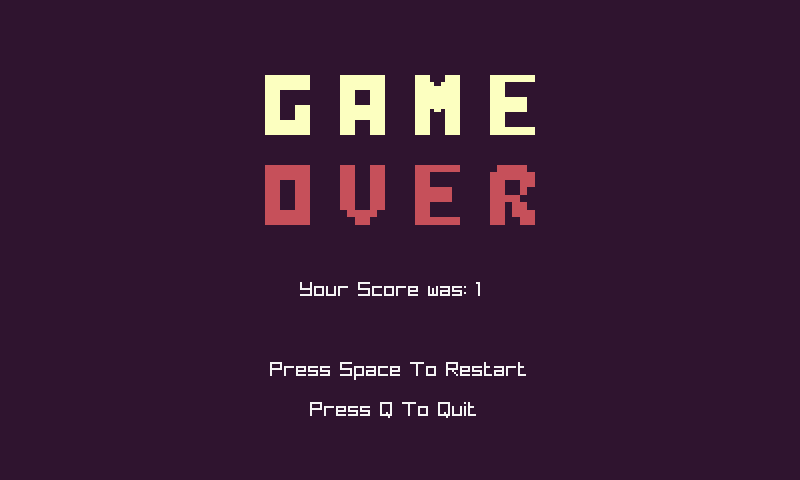

# Catch-The-Fish

<br>
<br>
<br>

A simple game about catching fish that are falling from the sky.

Check out its first implemantion over on [scratch](https://scratch.mit.edu/projects/810107102/).

Made with: [raylib](https://www.raylib.com/).

### Runing the game 

After setting up raylib you can simply use the bash script to compile and run.

```bash
# Compile
./build-tool

# Will compile and run the game
./build-tool run

# Clean compiled version
./build-tool clean

```

You can find the executable in ```/bin```.
